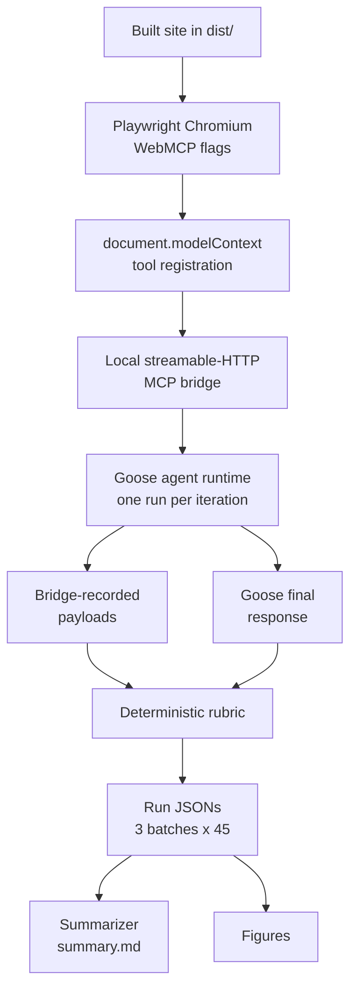

<div align="center">

# WebMCP Description Benchmarks

[](LICENSE)
[](results/rerun.md)

</div>

Do in-browser WebMCP tool descriptions, progressive disclosure, and response
caps let real agent runtimes complete content tasks, and at what token cost?

Supplementary data repository for a behavioral evaluation of the four WebMCP
tools exposed by the production site [clouatre.ca](https://clouatre.ca)
(`search_posts`, `get_post_markdown`, `get_related_posts`,
`get_posts_by_concept`). Three tasks (`discover`, `extract`, `traverse`) x
three models x five iterations were run with a Playwright-driven Chromium,
the real in-browser `document.modelContext` registration, and the
[goose](https://github.com/aaif-goose/goose) agent runtime (Agentic AI
Foundation) across three site configurations (baseline, delta, rerun). Companion
post: [WebMCP beyond checkout](https://clouatre.ca/posts/webmcp-beyond-checkout/).



*Figure 1: The evaluation harness pipeline. Each run serves the built site,
drives the agent through the real in-browser tool registration, grades a
deterministic rubric, and writes one run JSON; the summarizer and the
matplotlib figures are derived from those JSONs.*

## Status

**45/45 rubric passes with zero infra errors in the latest batch; token
medians within 4% of baseline in 7 of 9 cells.** Progressive disclosure plus
response caps held task completion without reducing tokens; the earlier
pagination change, not the caps, is what bounded payloads (6,764 tokens in one
unbounded `get_post_markdown` response to pages of at most 1,422 against a
2,000-token budget). Full findings: [results/rerun.md](results/rerun.md). Statistical comparison
of rerun vs baseline with composite scores and exact Mann-Whitney U tests is
in [results/comparison-stats.md](results/comparison-stats.md): composite
scores match rubric pass/fail in 89 of the 90 executed runs (the baseline
extract run for claude-haiku-4-5, iteration 1, scores 0.5 against a rubric
FAIL), no composite difference is significant in any of the nine cells, and
six cells show significant token differences (rerun lower in discover for
claude-haiku-4-5 and glm-5.3-flash; rerun higher in discover for gpt-6-luna,
extract for claude-haiku-4-5, and traverse for gpt-6-luna and
glm-5.3-flash).

| Batch | Site config | Rubric passes | Headline |
| --- | --- | --- | --- |
| [baseline](results/baseline.md) | post-pagination (#1632) | 44/45 | prompt-ambiguity failures fixed, 15/15 traverse |
| [delta](results/delta.md) | + caps and progressive disclosure (#1653/#1651) | 45/45 | caps induce a traverse retry loop for 2 of 3 models |
| [rerun](results/rerun.md) | + ordering fix (#1659) | 45/45 | retry loop gone; tokens within 4% of baseline in 7/9 cells |

*Table 1: The Stripe checkout benchmark against this blog's rerun; per-cell medians in Table 3.*

| Dimension | Stripe checkout | This blog, read-only |
| --- | --- | --- |
| Workload | Purchase; each step drops prior tools | Read-only; tools stay valid |
| Tool surface | Disclosure follows checkout state | Four tools cut to two or three |
| Completion | 100% in both arms | 45/45 rerun vs 44/45 baseline |
| Tokens | 42% fewer | Within 4% in seven of nine cells |
| Tool calls | 38% fewer | Flat; one to six per run, one rerun outlier at eight |
| Duration | 39% faster | Mixed by cell; batch median 6.5 s vs 7.6 s |

## Structure

- `scripts/webmcp-eval/harness.ts`: the behavioral eval harness. Serves the
  built site over localhost, launches Playwright Chromium with WebMCP feature
  flags, waits for per-page-kind tool registration, exposes the disclosed
  tools over a local streamable-HTTP MCP bridge, drives the agent headless per
  run, and grades a deterministic rubric from bridge-recorded payloads plus
  the agent's final response.
- `scripts/webmcp-eval/summarize.ts`: median/IQR summary per task-model cell
  from run JSONs.
- `scripts/webmcp-eval/compare.ts`: composite rubric scores and exact
  Mann-Whitney comparison of rerun vs baseline per task-model cell (writes
  `results/comparison-stats.md`).
- `scripts/webmcp-eval/compare.test.ts`, `scripts/webmcp-eval/summarize.test.ts`:
  bun tests for the stats and summary helpers.
- `scripts/webmcp-page-kind.ts`: vendored from the production site; the page-kind
  derivation the harness uses to know which tools a start page discloses.
- `scripts/audit-webmcp-payloads.ts`: point-in-time snapshot of the production
  site's payload budget audit (provenance for the payload JSON; site-coupled, not
  runnable here).
- `docs/audit/{baseline,delta,delta-rerun}/`: 135 run JSONs (3 batches x 45)
  plus machine-generated `summary.md` per batch.
- `docs/audit/2026-10-04-webmcp-payload.json`: payload token counts at three
  site commits (unbounded, paginated, capped), exact local BPE tokenizer.
- `docs/spike.md`: harness enablement findings (Chromium flags,
  `registerTool` semantics, goose per-run model selection and token usage).
- `results/`: the three written audit reports (baseline, delta, rerun).
- `data/charts/`: chart source data for the companion post's figures.
- `figures/`: matplotlib figures (Python scripts alongside their rendered
  PNGs, deterministic, regenerated from the committed run JSONs).

## Figures

Rerun on the fixed site held median tokens near baseline while keeping every
payload under budget. Scripts in `figures/` regenerate the PNGs with
`uv run --with matplotlib python figures/<script>.py`.


*Figure 2: Median total tokens per task-model cell (3 tasks x 3 models), baseline versus rerun. Rerun medians landed within 4% of baseline in 7 of 9 cells; the exceptions are extract, where Haiku's median rose 26% and GLM's fell 10%.*


*Figure 3: WebMCP payload tokens at three site commits against the budgets. The unbounded `get_post_markdown` response fell from 6,764 tokens to pages of at most 1,422 against the 2,000-token budget, and every discovery tool response stays under the 600-token budget.*

## Running the harness

Requires bun, Playwright 1.63+, goose 1.53+, and a built site in `dist/`
(secure context required by WebMCP). See
[METHODOLOGY.md](METHODOLOGY.md) for the full protocol.

```sh
bun run scripts/webmcp-eval/harness.ts \
  --output-dir docs/audit/<name> --iterations 5
bun run scripts/webmcp-eval/summarize.ts \
  --run-dir docs/audit/<name> --out docs/audit/<name>/summary.md
```

## License

Apache-2.0.
